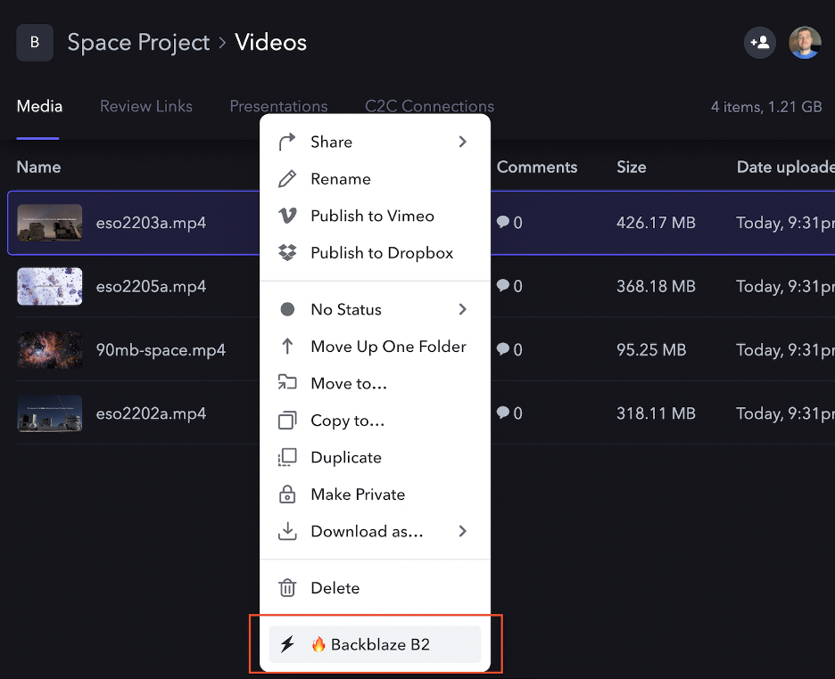

# Backblaze Custom Action for Frame.io

The Backblaze Custom Action for Frame.io allows you to quickly move data between [Backblaze B2](https://www.backblaze.com/b2/cloud-storage.html) and [Frame.io](https://frame.io/). Media professionals can use the action to export selected assets or whole projects from Frame.io to B2 Cloud Storage, and then later import exported assets and projects from B2 Cloud Storage back to Frame.io.

The root directory of the backblaze-frameio GitHub repository contains two directories corresponding to different deployment options, plus a directory of common code:

- [node-docker](node-docker) - generic Node.js deployment
- [node-risingcloud](node-risingcloud) - [Rising Cloud](https://risingcloud.com/) deployment
- [backblaze-frameio-common](backblaze-frameio-common) - common code to interact with Frame.io, B2
